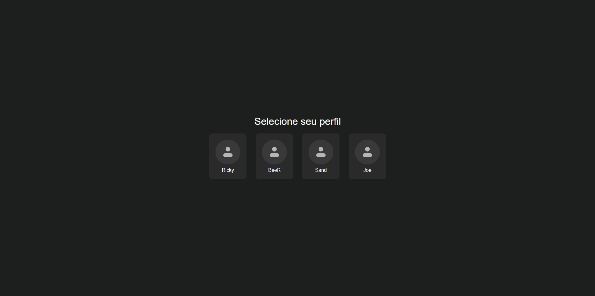
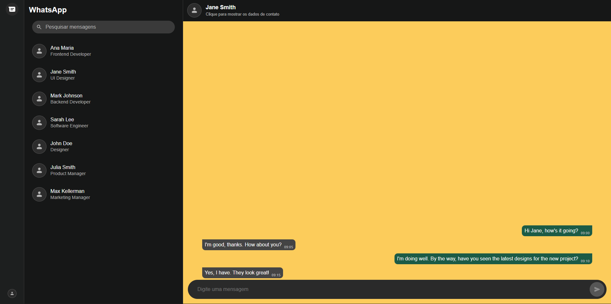

# Frontend Whatsapp API





Capturas de tela das áreas principais do site.

## Navegação
- [Sobre o Projeto](#sobre-o-projeto)
- [Tecnologias Utilizadas](#tecnologias-utilizadas)
- [Visualizando o Projeto](#visualizando-o-projeto)
- [Autor](#autor)

## Sobre o Projeto
Site de mensagens semelhante ao Whatsapp que consome a Whatsapp API desenvolvida durante as aulas de Backend do SENAI, permitindo escolher o perfil que será usado, visualizar os contatos dessa perfil e as conversas de cada um. Foi construído usando HTML, CSS, JavaScript e a Whatsapp API. Feito como atividade de Frontend do SENAI.

**Obs: a API demora cerca de 30 segundos para ligar, nesse tempo é necessário ficar reiniciando a página. Caso necessário faça isso com o console da página aberto.**

## Tecnologias Utilizadas
- JavaScript
- HTML
- CSS
- [Whatsapp API](https://github.com/zNathan2303/backend-senai_api-whatsapp)

## Visualizando o Projeto
O projeto pode ser visualizado [aqui](https://znathan2303.github.io/frontend-senai_api-whatsapp/).

Para rodar o projeto localmente, clone o repositório:
```bash
git clone https://github.com/zNathan2303/frontend-senai_api-whatsapp
```

## Autor
[Nathan da Silva Costa](<https://www.linkedin.com/in/nathandasilvacosta/>)